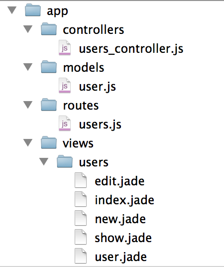

# Show Rest

## 准备

如果你不了解http协议，先看一下https://github.com/i5ting/node-http

## 什么是REST？

RESTful架构，就是目前最流行的一种互联网软件架构。它结构清晰、符合标准、易于理解、扩展方便，所以正得到越来越多网站的采用。

以下内容摘自阮一峰的文章：

一、起源

REST这个词，是Roy Thomas Fielding在他2000年的博士论文中提出的。

二、名称

Fielding将他对互联网软件的架构原则，定名为REST，即Representational State Transfer的缩写。我对这个词组的翻译是"表现层状态转化"。
如果一个架构符合REST原则，就称它为RESTful架构。

三、资源（Resources）

REST的名称"表现层状态转化"中，省略了主语。"表现层"其实指的是"资源"（Resources）的"表现层"。

四、表现层（Representation）

"资源"是一种信息实体，它可以有多种外在表现形式。我们把"资源"具体呈现出来的形式，叫做它的"表现层"（Representation）。

五、状态转化（State Transfer）

访问一个网站，就代表了客户端和服务器的一个互动过程。在这个过程中，势必涉及到数据和状态的变化。

六、综述

综合上面的解释，我们总结一下什么是RESTful架构：

（1）每一个URI代表一种资源；
（2）客户端和服务器之间，传递这种资源的某种表现层；
（3）客户端通过四个HTTP动词，对服务器端资源进行操作，实现"表现层状态转化"。

**说的通俗一点，改变url写法，让它带有状态，即语义化**

更多详见：

- http://www.ruanyifeng.com/blog/2011/09/restful.html
- http://www.restapitutorial.com/lessons/whatisrest.html

## 请求方法

一般会严格要求请求方法及其释义，下面给出常用的请求方法

* 如果请求头中存在 `X-HTTP-Method-Override` 或参数中存在 `_method`（拥有更高权重），且值为 `GET`, `POST`, `PUT`, `DELETE`, `PATCH`, `OPTION`, `HEAD` 之一，则视作相应的请求方式进行处理
* `GET`, `DELETE`, `HEAD` 方法，参数风格为标准的 `GET` 风格的参数，如 `url?a=1&b=2`
* `POST`, `PUT`, `PATCH`, `OPTION` 方法
    * 默认情况下请求实体会被视作标准 json 字符串进行处理，当然，依旧推荐设置头信息的 `Content-Type` 为 `application/json`
    * 在一些特殊接口中（会在文档中说明），可能允许 `Content-Type` 为 `application/x-www-form-urlencoded` 或者 `multipart/form-data` ，此时请求实体会被视作标准 `POST` 风格的参数进行处理

关于方法语义的说明：

* `OPTIONS` 用于获取资源支持的所有 HTTP 方法
* `HEAD` 用于只获取请求某个资源返回的头信息
* `GET` 用于从服务器获取某个资源的信息
    * 完成请求后返回状态码 `200 OK`
    * 完成请求后需要返回被请求的资源详细信息
* `POST` 用于创建新资源
    * 创建完成后返回状态码 `201 Created`
    * 完成请求后需要返回被创建的资源详细信息
* `PUT` 用于完整的替换资源或者创建指定身份的资源，比如创建 id 为 123 的某个资源
    * 如果是创建了资源，则返回 `201 Created`
    * 如果是替换了资源，则返回 `200 OK`
    * 完成请求后需要返回被修改的资源详细信息
* `PATCH` 用于局部更新资源
    * 完成请求后返回状态码 `200 OK`
    * 完成请求后需要返回被修改的资源详细信息
* `DELETE` 用于删除某个资源
    * 完成请求后返回状态码 `204 No Content`

上面是比较常见的，估计大部分人最常用的是2个，get和post，具体每个怎么玩，下面会给出实例

## 最常见的增删改查

以前大家都认为管理信息系统就是crud，认为没有啥技术含量，哎，真正能把crud写明白其实也不是一件容易的事儿

七个路由，见`app/routes/users.js`

其中4个路由是crud

*  GET    /users[/]        => user.list()
*  POST   /users[/]        => user.create()
*  PATCH  /users/:id       => user.update()
*  DELETE /users/:id       => user.destroy()

另外3个是页面渲染用的

*  GET    /users/new       => user.new()
*  GET    /users/:id       => user.show()
*  GET    /users/:id/edit  => user.edit()

那么我们先来看一下crud对应的请求方法

- get用于请求列表
- post用于创建
- patch用于更新，局部更新资源
- delete用于删除

对比上一节的内容，你会发现他们的含义貌似真的对了，唯一可能有争议是更新，有的人用put有的用patch，推荐patch

以前做java的时候会认为，创建、删除和更新都用post，查询和搜索用get，这样做没问题，只是不符合rest风格而已。

很多人和我讨论过到该不该rest，我的回答是

- [客户端 API 开发总结](https://cnodejs.org/topic/552b3b9382388cec50cf6d95)

## express代码分层

默认的express生成器生成的只有routes和views文件夹，相对比较简单，做大型应用怎么能少了mvc呢？

于是我仿照rails写了如下代码分层

- routes 路由层，只有url和中间件，不包含任何逻辑
- controllers 业务逻辑控制层
- models  模型层
- views  视图层

如下图

## 路由层

上代码

    var express = require('express');
    var router = express.Router();

    var $ = require('../controllers/users_controller');

    // -- custom

    /**
     * Auto generate RESTful url routes.
     *
     * URL routes:
     *
     *  GET    /users[/]        => user.list()
     *  GET    /users/new       => user.new()
     *  GET    /users/:id       => user.show()
     *  GET    /users/:id/edit  => user.edit()
     *  POST   /users[/]        => user.create()
     *  PATCH  /users/:id       => user.update()
     *  DELETE /users/:id       => user.destroy()
     *
     */

    router.get('/new', $.new);  
    router.get('/:id/edit', $.edit);

    router.route('/')
      .get($.list)
      .post($.create);

    router.route('/:id')
      .patch($.update)
      .get($.show)
      .delete($.destroy);

    module.exports = router;

和普通的路由代码一样，稍微改造了一下，统一了地址，应该是更清晰了。

这里只是引入了`users_controller`文件，完成请求地址和业务处理代码的映射而已。

这里还要讨论一个问题，每次增加一个接口就要加一个路由会比较烦，而且要在app.js里配置，能不能自动加载呢？比如app/routes目录下的所有js都可以挂载到app上

答案是可以的，使用我写的`mount-routes`即可，示例如下：

    var express = require('express')
    var app = express()

    var mount = require('mount-routes');

    // 简单用法，加载app/routes下的所有路由
    // mount(app);

    // 带路径的用法，加载routes2目录下的所有路由
    // mount(app, 'routes2');

    // 带路径的用法并且可以打印出路有表
    mount(app, 'routes2', true);

    // start server
    app.listen(23018)

更多内容见

[mount-routes](https://cnodejs.org/topic/556bd8ecf6ec9c0f020377c2)

## 控制层

    /**
     * Created by sang on 01/06/14.
     */

    var User = require('../models/user');

首先，控制层是控制业务处理的，所以它和模型层打交道比较多，同时控制视图如何展示

    exports.list = function (req, res, next) {
      console.log(req.method + ' /users => list, query: ' + JSON.stringify(req.query));
      User.getAll(function(err, users){
        console.log(users);
        res.render('users/index', {
          users : users
        })
      });
    };

请求所有列表，很简单，获取所有用户即可

    exports.new = function (req, res, next) {
      console.log(req.method + ' /users/new => new, query: ' + JSON.stringify(req.query));
  
      res.render('users/new', {
        user : {
          "_action" : "new"
        }
      })
    };

新建用户，实际是render视图而已，没有啥逻辑，user参数是为了我生成代码方便用的，无他

    exports.show = function (req, res, next) {
      console.log(req.method + ' /users/:id => show, query: ' + JSON.stringify(req.query) + 
        ', params: ' + JSON.stringify(req.params));
      var id = req.params.id;
  
      User.getById(id, function(err, user) {
        console.log(user);
        res.render('users/show', {
          user : user
        })
      });
    };

同new，是render视图代码

    exports.edit = function (req, res, next) {
      console.log(req.method + ' /users/:id/edit => edit, query: ' + JSON.stringify(req.query) + 
        ', params: ' + JSON.stringify(req.params));
    
      var id = req.params.id; 
  
      User.getById(id, function (err, user) {
        console.log(user);
        user._action = 'edit';
    
        res.render('users/edit', {
          user : user
        })
      });
    };

同new，是render视图代码

    exports.create = function (req, res, next) {
      console.log(req.method + ' /users => create, query: ' + JSON.stringify(req.query) + 
        ', params: ' + JSON.stringify(req.params) + ', body: ' + JSON.stringify(req.body));
  
        User.create({name: req.body.name,password: req.body.password}, function (err, user) {
          console.log(user);
          res.render('users/show', {
            user : user
          })
        });
    };

这段是创建用户的代码，根据post参数，保存入库，跳转到展示详情页面

    exports.update = function (req, res, next) {
      console.log(req.method + ' /users/:id => update, query: ' + JSON.stringify(req.query) + 
        ', params: ' + JSON.stringify(req.params) + ', body: ' + JSON.stringify(req.body));
    
        var id = req.params.id; 
  
        User.updateById(id,{name: req.body.name,password: req.body.password}, function (err, user) {
          console.log(user);
    
          res.json({
            data:{
              redirect : '/users/' + id
            },
            status:{
              code : 0,
              msg  : 'delete success!'
            }
          });
        });
    };

和创建类似，它是根据id来更新内容

    exports.destroy = function (req, res, next) {
      console.log(req.method + ' /users/:id => destroy, query: ' + JSON.stringify(req.query) + 
        ', params: ' + JSON.stringify(req.params) + ', body: ' + JSON.stringify(req.body));

      var id = req.params.id;
      User.deleteById(id, function (err) {
        console.log(err);
        res.json({
          data:{},
          status:{
            code : 0,
            msg  : 'delete success!'
          }
        });
      });
    };

和创建类似，它是根据id来删除内容

以上代码形式都是一样的

    exports.xxxx = function (req, res, next) {
      ...
    }

他实际上connect中间件的标准写法，如果你熟悉express，可以非常简单的上手，看了这些代码，你一定很好奇，User模型是怎么工作的，而且mongoose里并没有这些方法啊，下面会详细说明

## 模型层

我们的模型层使用的是比较传统的mongoose，如果需要promise库，可以搭配bluebird

    /**
     * Created by alfred on 01/06/14.
     */

    var mongoose    = require('mongoose');
    var Schema      = mongoose.Schema;
    var MongooseDao = require('mongoosedao');

    var userSchema = new Schema(
        {"name":"String","password":"String"}
    );

    var User = mongoose.model('User', userSchema);
    var UserDao = new MongooseDao(User);
 
    module.exports = UserDao;

这实际是最简单的定义mongoose模型的方法，我们唯一做的改进是增加了MongooseDao

DAO是java的概念，是data access object，即数据访问对象，就是传说的crud方法

你只要知道模型就好，为啥每个crud都要写呢？那得多烦啊

    var UserDao = new MongooseDao(User);
    
这样就可以给user增加了基本的crud方法

所以在controller里我们看到了如下代码

- User.getAll(function(err, users){
- User.getById(id, function(err, user) {
- User.create({name: req.body.name,password: req.body.password}, function (err, user) {
- User.updateById(id,{name: req.body.name,password: req.body.password}, function (err, user) {
- User.deleteById(id, function (err) {

这5个方法，完美的完成crud的所有操作，是不是很爽？至少少写了很多代码

而且当你想扩展的时候，你可以使用`User.model`来操作mongoose对象

比如login，我需要在User模型增加is_exist方法

    var mongoose    = require('mongoose');
    var Schema      = mongoose.Schema;
    var MongooseDao = require('mongoosedao');

    var userSchema = new Schema(
        {"name":"String","password":"String"}
    );

    userSchema.methods.is_exist = function(cb) {
      var query;
      query = {
        username: this.username,
        password: this.password
      };
      return this.model('User').findOne(query, cb);
    };

    var User = mongoose.model('User', userSchema);
    var UserDao = new MongooseDao(User);
 
    module.exports = UserDao;

这就是mongoose里的实例方法，static方法也是一样，你可以玩各种花样

然后控制层

    exports.login = function (req, res, next) {
      username = req.body.username;
      password = req.body.password;
  
      user = new User.model({
        username: username,
        password: password
      });
  
      return user.is_exist(function(err, usr) {
         。。。
      });
    }

是不是很简单？

## 视图层

视图层我们采用express默认的jade，无论各位怎么看，jade都可圈可点

1）extends 方式使用布局
2）include 复用模型代码
3）block 复用块代码

以new.jade和edit.jade为例，它们具有代表性

new.jade

    extends ../layouts/layout

    block content
      h1 New user
  
      include user

      a(href='/users') Back

edit.jade

    extends ../layouts/layout

    block content
      h1 Editing user

      include user

      a(href='/users/#{ user._id}') Show
      span |
      a(href='/users') Back

首先要说明的是include用法，include类似于partial概念，可以包含一个jade作为一部分

jade里有一个约定，你include了谁，它就要把这个对象传进去

所以user.jade里才是我们复用的重点

    - var _action = user._action == 'edit' ? '#' : '/users/'
    - var _method = user._action == 'edit' ? ""  : "post"
    - var _type   = user._action == 'edit' ? "button"  : "submit"
    - var onClick  = user._action == 'edit' ?  "click_edit('user-" + user._action + "-form','/users/" + user._id + "/')" : ""
    form(id='user-#{ user._action}-form',action="#{_action}", method="#{_method}",role='form')
      each n in ['user.name','user.password']
        - m = eval(n);
        div(class="field")
          label #{n.split('.')[1]} #{m}
          br
          input(type='text',name="#{n.split('.')[1]}" ,value="#{ m == undefined ? '' : m }")
        
      div(class="actions") 
        input(type='#{_type}',value='Submit',onClick='#{onClick}')
    
这段是为了复用写的代码，可读性不强，但可以说明include用法，对于代码而言，达到了一定的复用

实际上我们自己jade的适合要尽可能的拆分成小块去复用，当需求变得时候更容易应变。提醒强迫症患者，当心物极必反，不要刻意去强求

## 总结一下

RESTful架构大势所趋，代码写的标准了让人觉得赞

Expressjs下可以写的很规范，可以有做大应用，可以有很好的分层

展示了MVC + Routes的标准rest写法

使用了几个开源代码

- mount-routes
- MongooseDao

完成了以上工作，我们还要继续反思一下，既然rest是标准，写法很固定，是不是可以量产呢？答案是可以的，我展示的所有代码是根据一条命令搞定的

    moag user name:string password:string

这就是我目前在写的一个开源项目，待可用的时候会公开的，敬请期待

欢迎关注我的公众号【node全栈】

